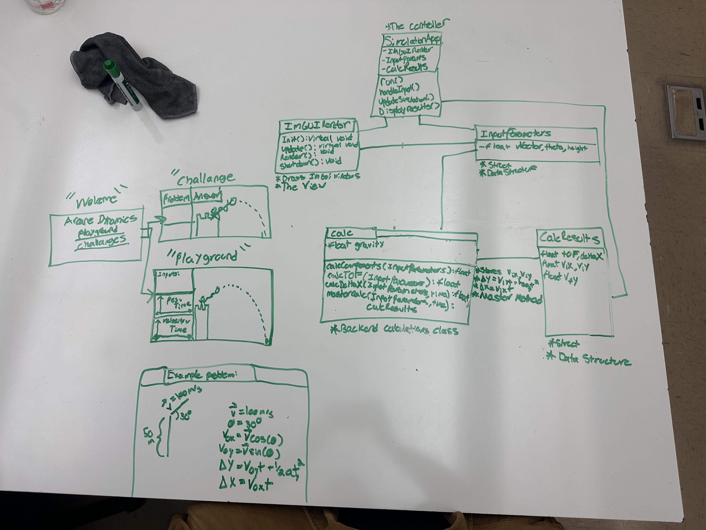

# 🪄 **Arcane Dynamics: The Scroll of Kinematic Sorcery**

Arcane Dynamics is a high-performance **C++ real-time 2D kinematics visualizer** wrapped in a fantasy “Arcane Dynamics” aesthetic. Built to help students learn projectile motion in a fun and engaging way, it blends physics, graphics, and interactivity—complete with a mage launching an animated fire projectile.

-----

## 📜 **Inspiration**

The idea was simple: take the dry world of textbook kinematics and infuse it with style.
Arcane Dynamics transforms 2D motion equations into a magical, interactive journey—perfect for helping kids visualize how physics *actually* works.

-----

## 🎯 **What It Does**

Arcane Dynamics instantly solves and visualizes any 2D projectile motion scenario. Provide any known combination of:

  * Initial velocity
  * Launch angle $\theta$
  * Initial height
  * Gravity
  * Time interval, and more…

…and the app calculates:

  * **Full Trajectory**
  * **Velocity Profile**
  * **Key kinematic values**

And displays them using two synchronized real-time plots:

1.  **Projectile Path Plot** – Position vs Distance *(x vs y)*
2.  **Velocity Plot** – Velocity vs Time *(v vs t)*

All while showing a stylized mage conjuring the projectile you just computed.

-----

## 🛠️ **How We Built It**

Arcane Dynamics is powered by a fast C++ visualization stack:

  * **C++** for physics + architecture
  * **GLFW** for windowing and input
  * **OpenGL** for rendering
  * **Dear ImGui** for the immediate-mode GUI
  * **ImPlot** for high-performance plotting
  * **CMake** for cross-platform builds

Careful use of ImGui fonts, color maps, and widget styling creates the unique ivy-green → brown fantasy aesthetic.

### ⚙️ **Styling Complexity**

Creating an entire theme required deep understanding of
`ImGui::PushFont`, `ImGuiStyle`, and state management for per-frame rendering.

### 📐 **Architecture**

The system was designed following a clear structure, which was documented using **UML diagrams** (e.g., `resources/UML-Diagram.png`, `resources/UML-HandDrawing.png`) before development began to ensure robust separation between the physics engine, rendering logic, and the UI layer.

-----

## ⭐ **Accomplishments We’re Proud Of**

  * **Seamless physics + GUI integration**
  * **Low-Level code**
  * **Complete fantasy aesthetic** with custom fonts and color transitions
  * **Robust architecture** built on CMake + Git submodules
  * **Polished UX** designed for students and non-technical users

-----

## 🎓 **What We Learned**

  * How immediate-mode GUI systems like ImGui manage state each frame
  * How C++ template linkage affects external libraries like ImPlot
  * How to make an entire GUI theme from one centralized styling function
  * Efficient plotting + frame management in real-time simulations

-----

## 🔮 **What’s Next**

  * **Interactive graph manipulation** (drag the launch angle or height directly)
  * **Challenges as Predefined Problems**
  * **Export graphs as images**
  * **Add more magical effects and spell variations**

-----

## 🧪 **Try It Out**

### 📥 **Clone the Repository**

```bash
git clone --recursive https://github.com/Jfroge/ArcaneDynamicsCutieHack2025.git
cd ArcaneDynamicsCutieHack2025
```

> ℹ️ **Important:**
> The project uses **Git submodules** (ImGui + ImPlot).
> `--recursive` ensures they are downloaded.

If you already cloned without `--recursive`, run:

```bash
git submodule update --init --recursive
```

-----

## 🚀 **Build & Run (CMake)**

### **1. Create a Build Directory**

```bash
mkdir build
cd build
```

### **2. Generate the Build Files**

```bash
cmake ..
```

### **3. Compile**

```bash
cmake --build .
```

### **4. Run**

```bash
./ArcaneDynamics
```

-----

## 🧩 **Submodule Credits**

Arcane Dynamics would not be possible without these open-source components:

  * **Dear ImGui** (included as a Git submodule)
  * **ImPlot** (included as a Git submodule)
  * **GLFW**
  * **OpenGL**

Special thanks to the creators and maintainers of these libraries.

-----

## 🧱 **Built With**

  * C++
  * GLFW
  * ImGui
  * ImPlot
  * OpenGL
  * CMake
Scenes
<p align="center">    </p>

UML Diagrams
<p align="center">   </p>
